# PrototypeRDBMS

## Custom RDBMS Implementation

---

# Design Principles in Prototype DBMS

In the development of the PrototypeRDBMS, I have adhered to Object Oriented Programming (OOPS) and employed SOLID design principles. Additionally, I have utilized other design principles, such as Factory, Singleton, and Builder, throughout the application development process. Below are examples demonstrating the application of these fundamental design principles.

## Single Responsibility Principle (SRP)

The Single Responsibility Principle dictates that a module should have only one reason to change. Throughout the project, I have adhered to this principle, ensuring loosely coupled classes. For instance, separate classes handle each database operation, exemplified by CreateQuery, SelectQuery, UpdateQuery, and DeleteQuery classes.

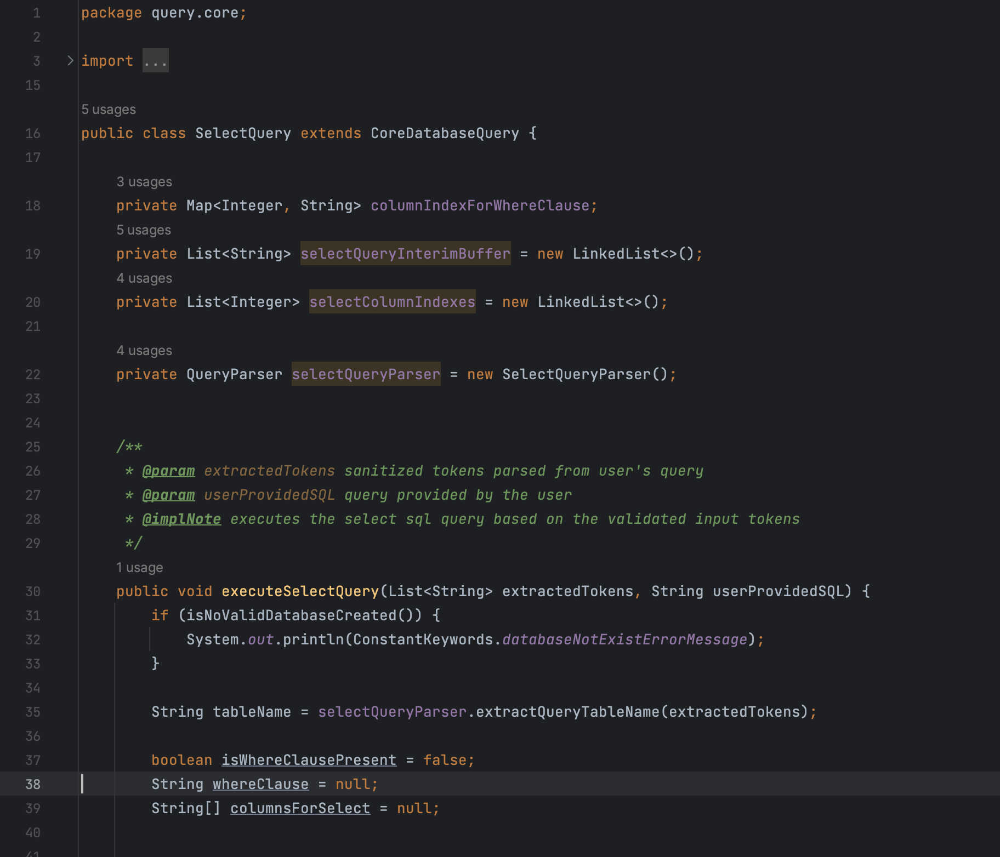

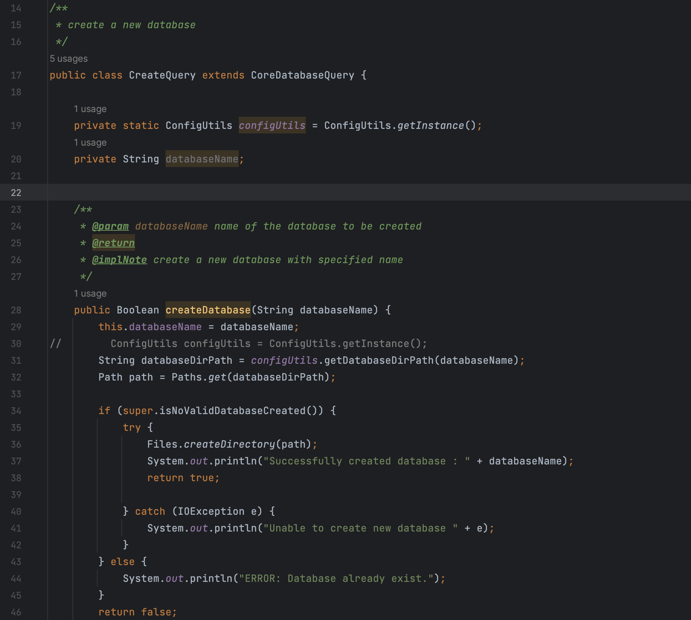

## Open / Closed Principle (OCP)

The Open/Closed Principle states that classes and modules should be open for extension but closed for modification. In the code snippet provided, a parent class, CoreDatabaseQuery, contains common methods required for all types of query execution. Child classes extend this and implement their respective CRUD query operations in separate concrete classes.


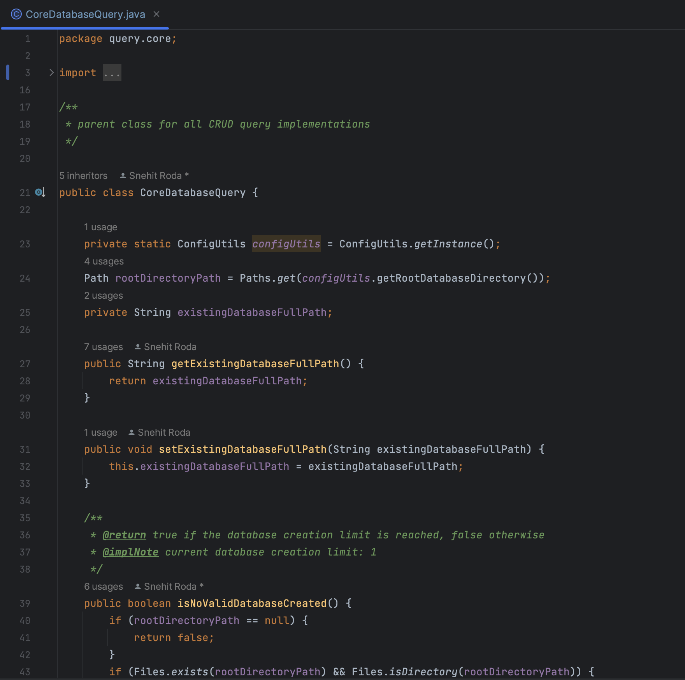


## Liskov Substitution (LSP) and Interface Segregation

The LSP states that objects of a superclass should be replaceable with objects of a subclass without affecting the correctness of the program. The code snippet below demonstrates application of SOLID principles especially the Single responsibility and the Liskov substitution.

I have declared a generic parameter which must be child class of CorDatabaseQuery. Then I have made multiple implementations of the interface methods which demonstrate the application of the Liskov substitution Principle (LSP). The below structure also clearly follows the Interface Segregation principle of SOLID. As the LSP principle states that: Clients should not be forced to depend on interfaces they do not use.

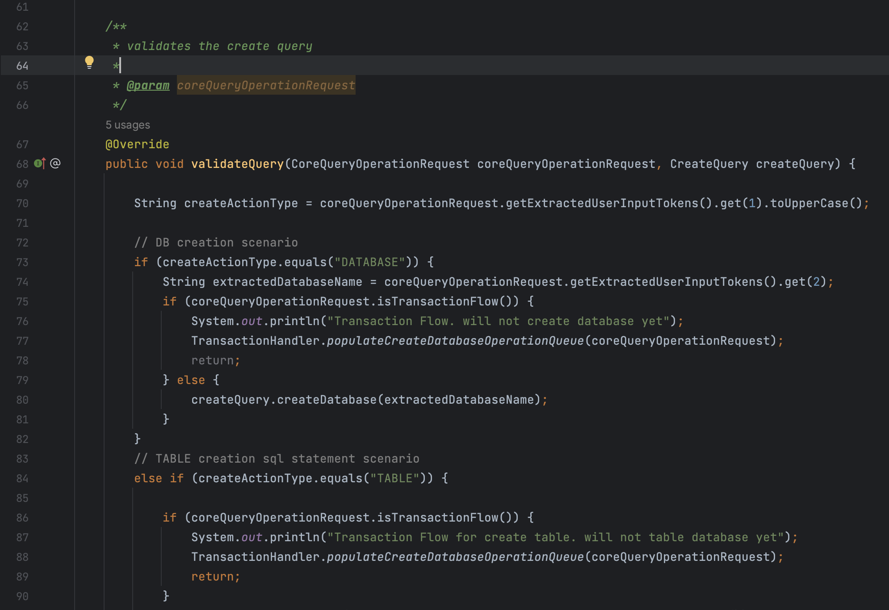

## Dependency Inversion (DIP)

Following the Dependency Inversion Principle, high-level modules should not depend on low-level modules. Instead, both should depend on abstractions. Throughout the development process, UserAuthentication, a high-level module, depends on the IEncryptDecryptService interface, which acts as an abstraction. This dependency is injected through the constructor, adhering to loose coupling.

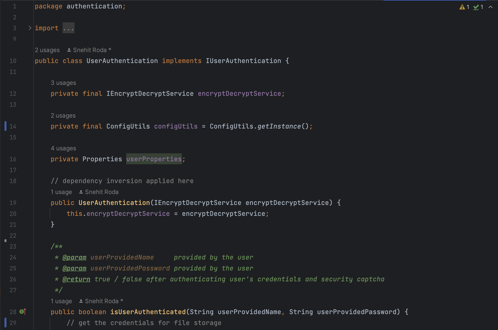


## Singleton Design Pattern and Builder Design Pattern

The ConfigUtils class is implemented as a Singleton, ensuring a single instance in the application. The getInstance() method follows lazy initialization, creating the instance only when required. This singleton class manages the loading and accessing of configuration properties.


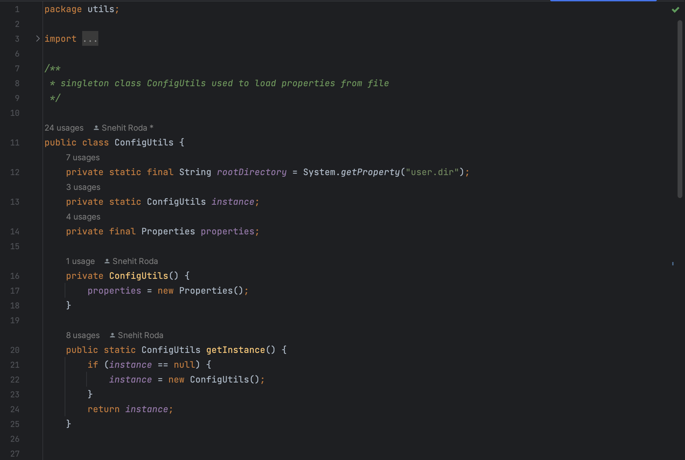

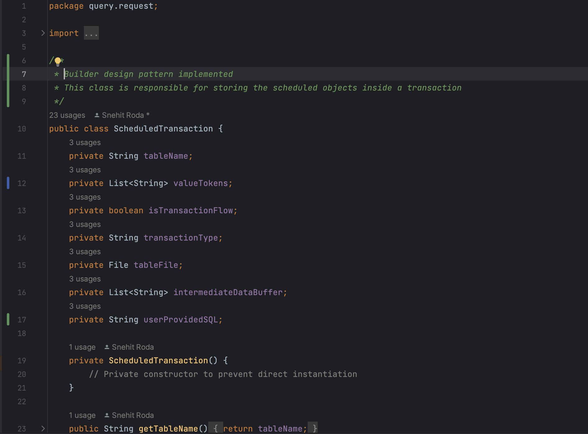


---

# Sequence of Queries Executed for Functional Testing

Queries executed:

1. CREATE TABLE student ( student_id INT PRIMARY KEY, name VARCHAR(255), date_of_birth DATE, course VARCHAR(255), course_duration INT);
2. CREATE TABLE employee ( employee_id INT PRIMARY KEY, name VARCHAR(255), hire_date DATE, job_title VARCHAR(255), salary DECIMAL(10, 2));
3. CREATE TABLE order_table ( order_id INT PRIMARY KEY, customer_name VARCHAR(255), order_date DATE, total_amount DECIMAL(10, 2), status VARCHAR(50));

---

# Transaction Validation Testing

## Sequence of Queries Executed:

```
BEGIN TRANSACTION
INSERT INTO employee VALUES (1, Steven Rogers, 2023-10-26, Manager, 75000.00);
SELECT * FROM employee
COMMIT
SELECT * FROM employee
END TRANSACTION
```

The transaction sequence follows the ACID property, with changes committed to the file only upon encountering the COMMIT keyword.

```
SELECT * FROM employee
COMMIT
SELECT * FROM employee
END TRANSACTION
```

Update query changes persist to the file only when COMMIT is encountered, showing results at each step of the transaction flow execution.

## Sequence of Queries Executed:

```
BEGIN TRANSACTION
DELETE FROM employee WHERE employee_id = 1
SELECT * FROM employee
COMMIT
SELECT * FROM employee
END TRANSACTION
```

The delete query is executed within a transaction. Changes are not immediately reflected, persisting to the file storage only upon encountering the COMMIT keyword.

## Queries Executed with Rollback:

```
BEGIN TRANSACTION
INSERT INTO employee VALUES (1, Steven Rogers, 2023-10-26, Manager, 75000.00);
SELECT * FROM employee
ROLLBACK
SELECT * FROM employee
END TRANSACTION
```

Since the transaction was rolled back, the insert query data would not be persisted to the file upon execution.

## Select Query Validation:

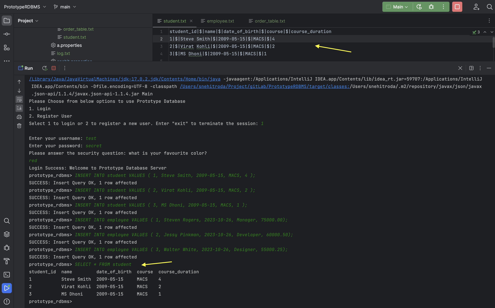

## Select With Where Clause Validation:

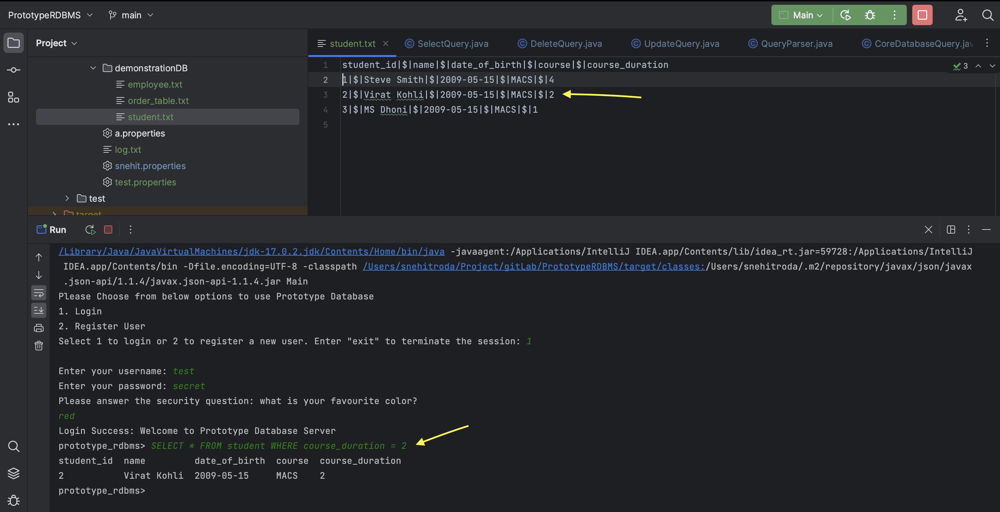

## Insert RollBack Validation Testing:

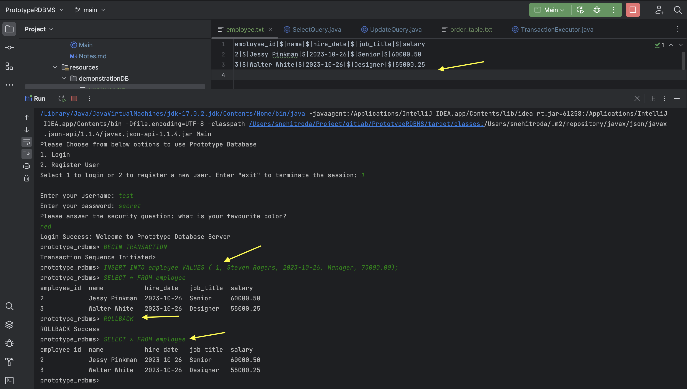

## Delete RollBack Validation Testing:

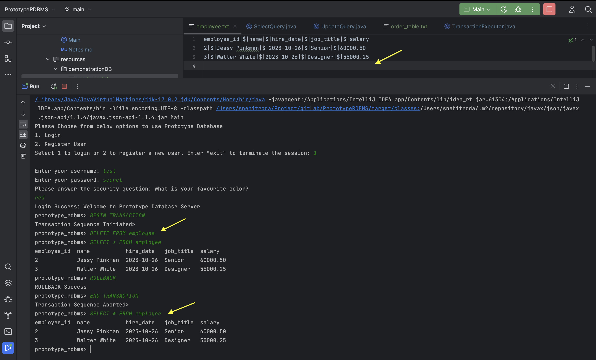

## Transaction Update Validation:

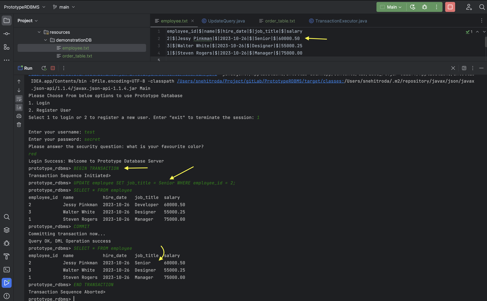


